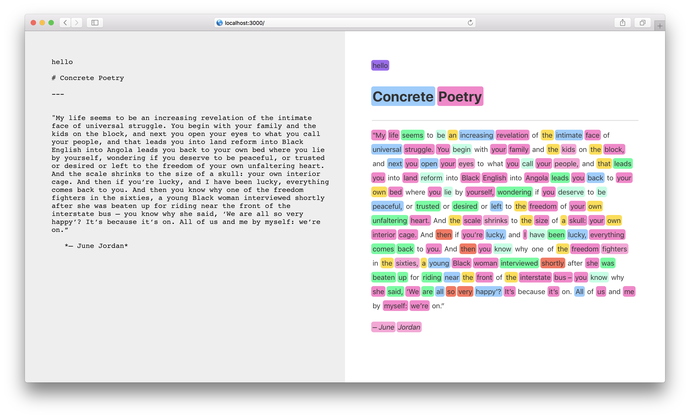

# nlp-markdown

nlp-markdown is a text editor with built-in part-of-speech highlighting

i remember coming across [laurel schwulst's concrete poetry channel](https://www.are.na/laurel-schwulst/concrete-poetry--2) on are.na and being inspired to see what kind of minimal illustrations might emerge if we selectively highlighted different types of words – what could we draw, for example, with adverbs versus nouns?

the app includes functionality that allows for toggling particular types of words, coloring them differently, etc. 

a handful of syntax-color pairs are included by default, accessible under the settings tab – ideally this info will be saved to local storage for offline use

built with

- [create-react-app](https://create-react-app.dev/)
- [react-markdown](https://github.com/rexxars/react-markdown)
- [react-spring](https://www.react-spring.io/)
- [compromise](http://compromise.cool/)
